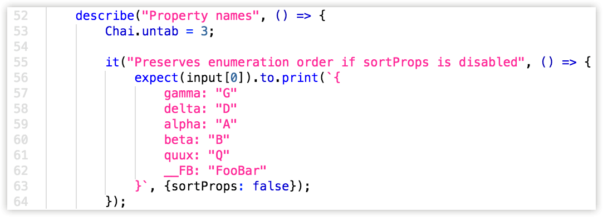
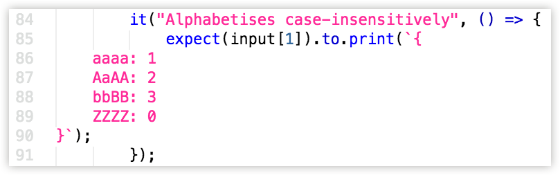

Chai-Untab
==========

Remove leading indentation from multi-line strings before running assertions.



ES6 string templates are ace, but they're slightly awkward for storing multiline
data when indentation's involved. If you need to compare large chunks of text in
your tests, you'd need to strip leading tabs entirely, or use a regex to prune a
specific number of tabs from the string before comparison:



Neither approach is particularly elegant.

A [module](https://www.npmjs.com/package/print) I wrote needed to run many tests
involving multiline strings, so I wrote this little helper. It's not as seamless
as using triple-quoted strings in CoffeeScript or Python, but it works well.

Made for Mocha, but will probably work for any test-runner with `beforeEach` and
`afterEach` hooks.


Usage
-----
1. Require `chai-untab` somewhere in your tests. It only needs to be run once.
2. Set Chai's `untab` level, like this:

	```js
	const chai = require("chai");
	chai.untab = 2; // Or however many columns you need to prune
	```
3. Update the `untab` level wherever the surrounding code's indentation changes:

	```js
	describe("Some spec", () => {
		Chai.untab = 2;
		
		describe("Another spec", () => {
			Chai.untab = 3;
			
		});
	});
	```
	
Yes, this has to be done manually, but it's better than nothing.


Trimming blank lines
--------------------
This module also trims blank lines from the start and end of your strings, which
enables you to easily stuff like this:

~~~js
expect(stringBlock).to.equal(`
	
	First line:
	- Second line
		* Etc

`);
~~~

Given an `untab` setting of `1`, the preceding example matches this:

	First line:
	- Second line
		* Etc


You can, of course, disable this extra behaviour:

~~~js
Chai.untabTrim = false;
~~~


Important
---------
* **This doesn't magically scan your code to detect its tab-width.** You need to
  set what tab character your code uses by setting `Chai.untabChar`. By default,
  it uses a hard tab (`\t`).

  So if you have anamorphic vision and prefer 2-space tab-stops for some reason,
  the top of your test would look like this:
	
	```js
	chai.untab = 2;
	chai.untabChar = "  ";
	```
	
* **This only affects strings being checked directly in an assertion.** So, this
  doesn't work:

	```js
	expect(objectWithString).to.equal({
		object: `{
			A
			B
			C
		}`
	})
	```
  Same deal for any assertion method that isn't `equal` or `string`: `deepEqual`
  won't be affected by the current level's "unindentation" settings.

* **This works for BDD only.** Chai's API doesn't expose a method for overriding
  `assert.equal()` so this module's effect is limited to [expect/should] only.


[Referenced links]: ____________________________________________________________
[expect/should]: http://chaijs.com/api/bdd/
